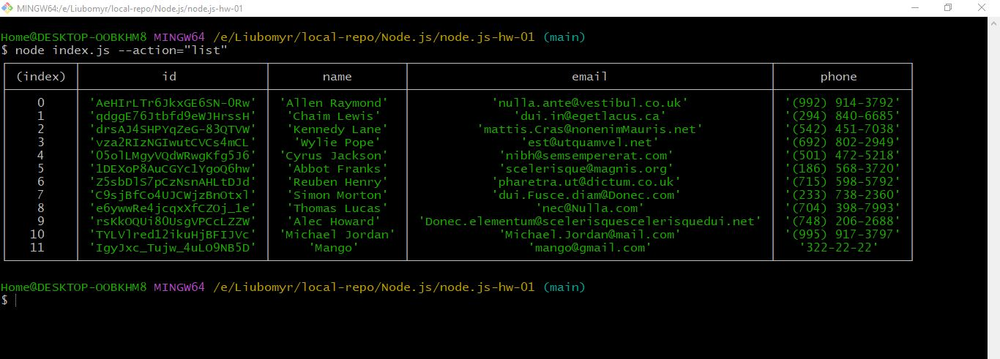
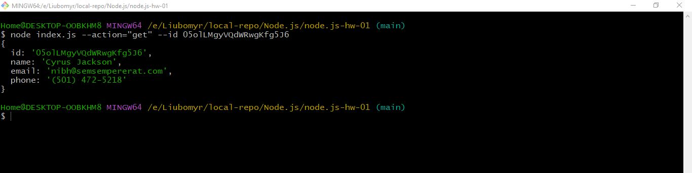
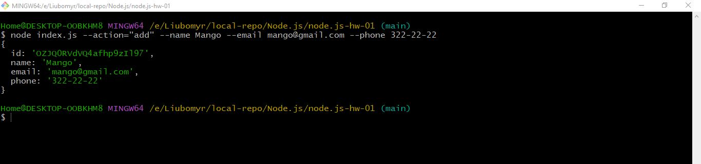
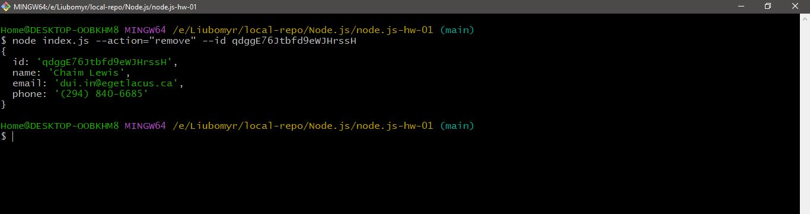

# Get and display the entire list of contacts in the form of a table (console.table)

`node index.js --action="list`

https://monosnap.com/file/7Mk4J0sN8Eg9w2nUBMBXWIvAIANQvV

# Get contact by id

`node index.js --action="get" --id 05olLMgyVQdWRwgKfg5J6`

https://monosnap.com/file/Kbjuff3RoUu5eV216zCLQKEb8AdHEv

# Add the contact

`node index.js --action="add" --name Mango --email mango@gmail.com --phone 322-22-22`

https://monosnap.com/file/HjrymJHjaLuj7HMMJhKM1tS2VzAieE

# Delete the contact

`node index.js --action="remove" --id qdggE76Jtbfd9eWJHrssH`

https://monosnap.com/file/5u47eSs3iDtGMsP3G7hC3dXFY5ealF
